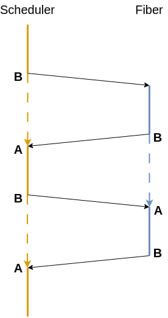

## Задача

Вам предстоит реализовать асинхронную кооперативную многозадачность на C++.

Реализуйте все необходимые функции помеченные TODO

За задачу предусмортрены частичные баллы, однако непрохождение каждого теста блокирует прохождение следующих.

## Fiber

Реализуйте на x86_64 переключение контекста `Context::switch_context` - а именно "прыжок" из "середины" одной функции в "середину" другой.

Возможно изображение ниже поможет чем-то

Стоит отметить, что такое поведение с точки зрения компилятора С++ не является "ожидаемым", поэтому делая это ДЗ вы стреляете себе в ногу...

## Epoll scheduler

Реализуйте все необходимые функции планировщика.

### Inspector

На самом деле это просто колбек для возможности модицикации поведения файбера при переключении контекста. 

В том числе при переключении можно "украсть" файбер у пларовщика чтобы вернуть его потом когда-либо

### Exceptions

Функции, реализованные в `Async` должны корректно обрабатывать исключения, которые поступают в epoll. Также, должны корректно обрабатываться исключения, происходящие в ходе выполнения файберов.

## Async

Реализуйте аналоги стандартных функций `read`, `write` и `accept` для использования внутри файберов. 
Эти функции не должны вызывать соответсвующие системные вызовы напрямую, а должны подписываться через epoll на события, 
и, как только данные будут готовы - продолжить выполнение.
